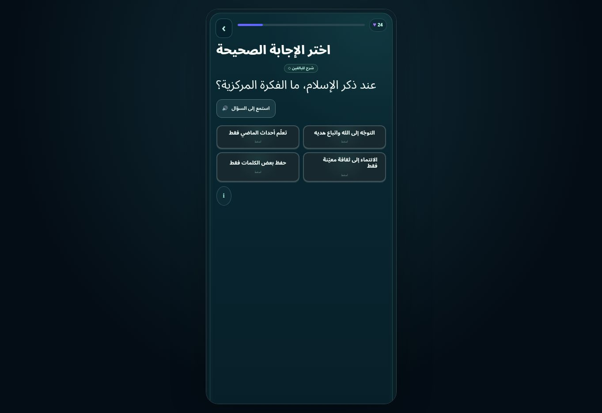
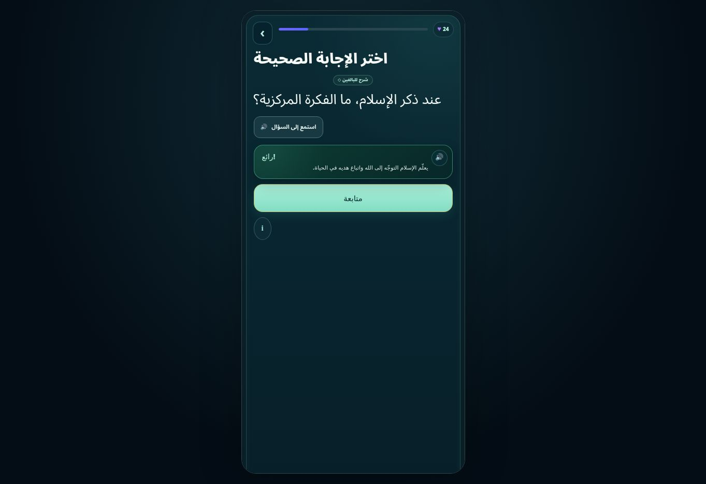

# DEEN v9.12.70 — 9 Ekim 2026 doğrulama raporu

Build: `9390cssarabic1`. Başlangıç `main@98b100c0f6743f7b4461041644e36fb2e60318e1`.
Bu tur, önceki onarımı yeniden denetledi ve canlı sitede görülen yeni yerelleştirme açıklarını kapattı. Önceki [v9.12.68 raporu](REPORT.md) tarihsel kök neden ve ilk onarım kanıtlarını içerir. **Teknik testlerden geçmek, Arapça anlam içeriğinin ve dinî uzman incelemesinin tamamlandığı anlamına gelmez.**

## 1. Donmanın kök nedeni ve mevcut kanıt

Önceki onarımda iki ayrı darboğaz saptanmıştı: Arapça DOM tarayıcısı SCRIPT/STYLE içindeki büyük kaynaklara çeviri regexleri uyguluyordu; tekrar uygunluğu hesabı ise her aday soru için tüm bankayı ve bitirilmiş aşamaları yeniden tarıyordu. Chromium yığını `learnedConceptSet640 → allowed640 → eligible → dueCount → NextAction.evaluate → renderHome → guardedReturnCard → updateUI` idi. [Eski yığın](old-stall-stack.json) ve v9.12.68 raporu bu teşhisin kanıtlarıdır; bunları bu turun yeni ölçümü olarak sunmuyoruz.

Mevcut merkezi çevirici kaynak kodunu taramaz. Tekrar indeksleri durum değişiminde geçersiz olur. Maskot gözlemcisi yeniden kullanılır. Bu turda mevcut kararlılık tekrar test edildi: 1.584 render, 105 teknik ders başlangıcı, 75 makro başlangıcı, 75 giriş ekranı, tekrar yolları ve yenileme tamamlandı. Gözlemci oluşturma sayısı 29 → 29 (26 aktif); global dinleyici kayıtları 423 → 423. Beş saniye boşta CDP TaskDuration 0,634699 s; uzun görev 0. GC sonrası heap 18.700.808 byte. Tam test koşusunda 404 uzun görev, en uzunu 500 ms vardı. Aynı yoğun koşuda 323.329 observer callback, 2.708.245 gözlenen mutation ve toplam yaklaşık 3.571 ms observer callback süresi ölçüldü; bunlar beş saniyelik boşta ölçüm değildir. Bu, donmanın testte tekrarlanmadığı anlamına gelir; uzun görevlerin tamamen yok edildiği veya fiziksel cihaz performansının garanti edildiği anlamına gelmez.

## 2. Türkçe metinlerin nedenleri

Önceki ana soru sorununun nedenleri çakışan pilot/tam banka başlatıcıları, yanlış makro aşama eşlemesi, canlı U01 varyantları ve sonradan başlığı yeniden Türkçe yazan sunum katmanlarıydı. Tek yetkili soru yolu kaynak parmak izini doğrular; başarısız ID için ders durur, Türkçe soruya sessiz fallback yapılmaz.

Bu turda canlı sitede farklı bir açık görüldü: görünür başlıklar Arapça olsa bile birleşik `aria-label` metinleri kısmen Türkçe kalıyordu. Kısa parça çevirileri tam başlık çevrilmeden devreye giriyordu. `Yeni ilerleme`, `0 Seri`, aşama başlangıç CTA'sı ve bir dinleme hedefi de önceki kontrollerden kaçmıştı. Ayrıca ders ve ayet sesi düzenleyicileri bazı erişilebilirlik etiketlerini sonradan tekrar Türkçe yazıyordu. Canlı gerçek çoktan seçmeli soruda CSS `::after` kaynaklı DOKUN etiketi de görüldü; DOM textContent/innerText taraması bunu yakalamamıştı. Arapça CSS kurallarıyla dokun/seçildi/doğru/tekrar bak/boşluk/rozet/değiştir/yeni ders etiketleri düzeltildi. Test şimdi soru ve geri bildirimde computedStyle üzerinden `::before` ve `::after` içeriğini de denetler.

## 3. Bu turdaki dosya değişiklikleri

| Dosya | Değişiklik |
|---|---|
| `index.html` | Seçilen dil, uygulama yüklenmeden dil seçim ekranına da uygulanır; altı dilde metinler; yeni build ve 67 içerik hash'i |
| `assets/i18n/boot.js` | Sürüm/build güncellemesi; mevcut gerçek yükleme ve kayıt koruma akışı korunur |
| `segment-24.txt` | Öğrenme stili başlığı Arapçada bütün cümle olarak render edilir; ders çıkış/ilerleme/dinleme etiketleri seçilen dilde doğrudan üretilir; production build uyumu |
| `segment-48.txt` | Birleşik metinlerde tam bileşen çevirisi; sınırlı erişilebilirlik attribute gözlemi; SVG etiketlerini içerikleri değiştirmeden çevirme; eksik ana ekran, soru ve Kur'an etiketleri |
| `segment-52.txt` | Ayet sesi oynat/duraklat etiketi seçilen dilde üretilir; aynı etiketi tekrar yazma engellenir |
| `segment-66.txt` | Ünite 10/12/13/14/15 başlıkları gerçek konu kapsamına hizalanır; yeni build tokenları; CSS ile üretilen 14 Arapça etiket kuralı |
| Dört `scripts/test-arabic-*.cjs` dosyası | Ana ekran, 75 ders giriş ekranı, 15 soru tipi ve Kur'an yüzeylerinde görünür metin yanında aria/title/alt kontrolleri; CSS pseudo metinleri ve gerçek ses zamanını bekleme |

Yeni başlatıcı veya ayrı locale motoru eklenmedi. Kullanıcı ilerlemesini açan/sıfırlayan test verisi yalnız geçici test profillerinde bulunur. Giriş sağlayıcıları aynı mevcut simülasyon açıklamasını korur; gerçek Apple/Google/e-posta backend'i eklenmedi.

## 4. Soru ve aşama kapsamı

| Kontrol | Sonuç |
|---|---|
| Türkçe kaynağa göre temel soru ID ve şema | 1.500 / 1.500; 15 × 100 |
| Doğru seçenek konumu | Hata 0 |
| Kaynak uyumsuzluğunda ret | 1.500 değiştirilmiş kaynak reddedildi |
| Matching / sequence / boşluk içeren temel kayıt | 139 / 38 / 282 |
| U01 canlı kayıt / uyumluluk varyantı | 84 / 20 |
| Gerçek teknik ders başlangıcı | 105 / 105, Arapça render |
| Gerçek görünür makro başlangıcı | 75 / 75 |
| Giriş ekranı metin ve erişilebilirlik kontrolü | 75 / 75 |
| Kanonik renderer taraması | 1.584 benzersiz ID: 1.500 temel + 84 canlı |
| Soru tipi, gerçek buton/input işlemi | 15 / 15 |
| Tekrar | smart, quick, mistakes, weak, due geçti |

105 aşamanın her birinde gerçek başlangıç ve render kontrol edildi. 1.584 kaydın her biri kanonik renderer ile gösterildi. Bunların hepsinin bir insan tarafından baştan sona cevaplandığı veya dilsel/dinî uzman tarafından onaylandığı iddia edilmez. Güncel aktif banka 1.484 kayıttır: eski U01'in 100 temel kaydının yerine 84 canlı kayıt kullanılır; temel banka ayrıca denetlenir.

## 5. Test sonuçları

- Açılış: dil seçimi giriş seçeneklerinden önce; isim, üç anlatım, altı maskot, süre, özet ve gerçek hazırlık akışı geçti.
- U07 HTTP 503 enjeksiyonu: %100 gösterilmedi, onboarding tamamlanmadı; yeniden deneme ile hazır duruma geçildi.
- Locale/cache: Arapça yenilemede korundu; bozuk segment yeniden indirildi; eski release cache kaldırıldı. XP 321 ve tamamlanan U01-S01 korundu; kayıt sıfırlanmadı.
- Mobil/masaüstü: 320, 390 ve 1440 px kontrolleri geçti. Bunlar viewport testidir; fiziksel Android/iOS veya Safari testi değildir.
- Etkileşim: matching, fill, sequence, true/false, scenario ve diğer kullanılan tiplerle 15 ayrı gerçek cevap yolu geçti.
- Regresyon: 12 soruluk ders tamamlandı; XP 777 → 817, currency 10 ve U01-S01 tamamlanması yenilemede korundu; enerji ödülü 10 → 20. Maskot, 10 rozet görseli ve admin paneli kontrolü geçti. Türkçe gerçek makro dersi yeniden açıldı.
- Kur'an: 16 surede ilk ayet sesi gerçekten ilerledi; 90 ses kaydı denetimi geçti. Öğren, Ezber, 16 Ayet Testi, beş pratik türü ve arena yolları kontrol edildi. 90 ayetin kayıtlı metni önce/sonra aynı kaldı; Fâtiha kelime vurgusu oynayan sesle kontrol edildi.
- Statik: 193 inline script + boot.js derlendi; 67 segment hash'i tutarlı; 1.500 soru yapısal denetimi geçti.

Sayısal çalışma zamanı özeti: [verification-2026-10-09.json](verification-2026-10-09.json). Testler `scripts/test-arabic-{startup,interactions,quran,regression,runtime}.cjs` ile yeniden çalıştırılabilir. Yeni testler ilk koşularda eksik etiketleri yakalayıp başarısız oldu; etiketler kaynakta düzeltildikten sonra ilgili kontroller tekrar çalıştırıldı.

## 6. Yayın ve canlı kanıt

Uygulama commitleri:

- `7ef61a75bf7addf60af2625d89bb8d1b2da6662d` — onboarding, birleşik etiketler ve genişletilmiş kontroller.
- `5488cb1d1c9dff3e6b14dae7f71cee28ee40d63e` — Kur'an ses düğmesinin dili doğrudan koruması.

- `8e661aee16c7d34178eb50176e218fab06abd249` — ses testi sabit 250 ms yerine 10 saniye içinde gerçek zaman ilerlemesini bekler. Main CI 37898215993 sabit beklemede currentTime=0 ile başarısız olmuştu; gerçek oynatma gereksinimi kaldırılmadı.
- `7adccae95f2628a6d10f7a0ca7b765319a37f302` — CSS kaynaklı Türkçe etiketlerin Arapça kuralları ve soru/geri bildirim test kapsamı.

Son yerel kaynak Git ağacı ile GitHub uygulama ağacı aynıdır: `53f71ec6625015a4749f928fcbf550dfe3a9b7a4`. Canlı Chrome, Pages URL'sinde v9.12.70 ve `9390cssarabic1` build'ini gösterdi. Test profili yenilemede korundu; U01-M01 girişinden **gerçek UI düğmeleriyle** çoktan seçmeli soru açılıp doğru seçenek tıklandı. Soru: `عند ذكر الإسلام، ما الفكرة المركزية؟`; seçenek: `التوجّه إلى الله واتباع هديه`; açıklama: `يعلّم الإسلام التوجّه إلى الله واتباع هديه في الحياة.` CSS seçenek etiketi `اضغط` oldu. Bu kanıt yerel ekran değil, yayımlanmış Pages ekranıdır.

Canlı doğrulanan URL: https://ilgazfindik.github.io/DEEN-App/?build=9390cssarabic1

Bağımsız son doğrulamalar başarılı:

| GitHub işlemi | Sonuç | Run |
|---|---|---|
| Çalışma dalı Arapça denetimi | success | [37898995751](https://github.com/ilgazfindik/DEEN-App/actions/runs/37898995751) |
| Main Arapça denetimi | success | [37898997235](https://github.com/ilgazfindik/DEEN-App/actions/runs/37898997235) |
| GitHub Pages | success | [37898996669](https://github.com/ilgazfindik/DEEN-App/actions/runs/37898996669) |

Main CI beş gerçek Chromium testini ve statik denetimleri çalıştırdı. CI boşta beş saniye TaskDuration 0,46769 s ve uzun görev 0 ölçtü; bu değer yerel ölçümden ayrıdır. 16 surede gerçek currentTime > 0 ses ilerlemesi görüldü. [Seçili CI logları](ci-2026-10-09.txt) ve [yayın kaydı](deployment.json).

## 7. Tamamlanmayan içerik ve testler

**Arapça anlam/meal içeriği depoda kaynakla doğrulanmış olarak bulunmuyor.** Bu içerik uydurulmadı. Arapça anlam testi ve ona bağlı finalde açık eksiklik mesajı vardır; Türkçe meal sessizce gösterilmez. Bu gereksinim tamamlanmış sayılamaz.

**1.500 temel çevirinin insan Arapça/dinî uzman onayı 0.** `release_ready`, `verified_by_religious_expert` alanları gerçek onay olmadan true yapılmadı. Otomatik yapı/ID/cevap kontrolü, tüm yanlış seçeneklerin anlam ve mezhep doğruluğunun uzman onayı değildir.

Ses kelime zaman damgası bulunan ayet sayısı 0. Mevcut ağırlıklı vurgulama çalışır; kesin kelime hizalaması doğrulanmadı. Fiziksel cihazlar, Safari, gerçek giriş backend'i ve saatlerce saha dayanıklılığı çalıştırılmadı. Ürünün yüzde yüz içerik tamamlığı için kaynaklı Arapça anlam içeriği ve insan uzman incelemesi gerekir.
